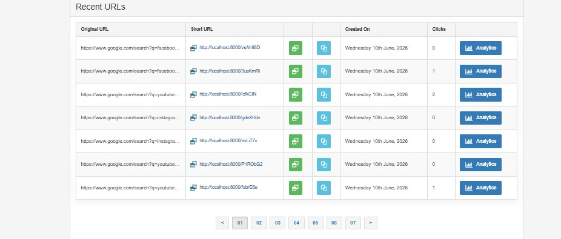
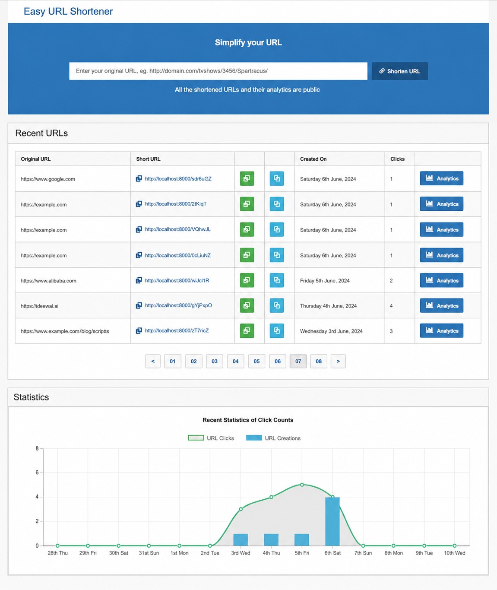
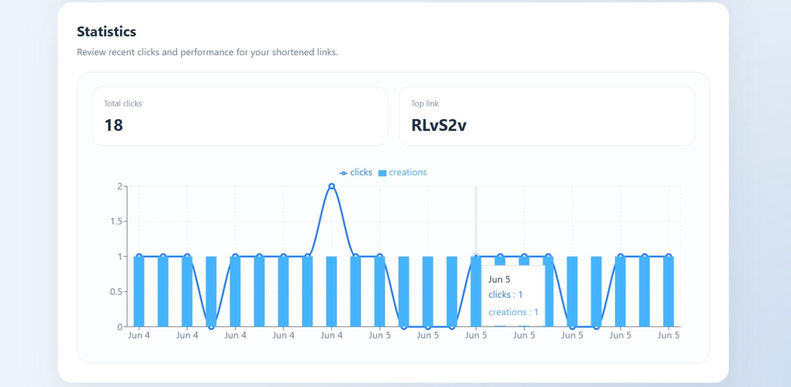

# URL Shortener

A full-stack URL shortener built with React + TypeScript (frontend) and FastAPI + SQLite (backend). Shorten long URLs, track clicks, and view analytics — all in a clean, responsive interface.

## Features

- **URL shortening** — Paste any URL, get a short link instantly
- **Click tracking** — Every redirect is counted and timestamped
- **Analytics dashboard** — View daily click breakdown per URL
- **Copy to clipboard** — One-click copy for all short links
- **Server-side pagination** — Fast list loading regardless of database size
- **Rate limiting** — Configurable per-IP request throttling (default: 10/min)
- **SSRF protection** — Blocks private/internal IP addresses in URLs
- **Input validation** — URL length cap (8192 chars), format checks, protocol enforcement
- **Security headers** — X-Content-Type-Options, X-Frame-Options, XSS protection, Referrer-Policy
- **Error boundaries** — Graceful crash recovery in the UI
- **Responsive design** — Works on desktop, tablet, and mobile
- **Code splitting** — Lazy-loaded table and chart components for fast initial load

## Screenshots

### Homepage


### Analytics


### Mobile View


### Statistics


## Tech Stack

| Layer | Technology |
|-------|-----------|
| Frontend | React 18, TypeScript, Vite, Recharts |
| Backend | Python, FastAPI, Pydantic v2 |
| Database | SQLite (WAL mode) |
| Testing | Pytest (backend), Vitest + Testing Library (frontend) |

## Project Structure

```
url-shortener-main/
├── backend/
│   ├── main.py              # App entry, middleware, lifespan
│   ├── config.py            # Environment-driven configuration
│   ├── database.py          # SQLite connection pool & schema
│   ├── models.py            # Request/response validation (Pydantic)
│   ├── repositories.py      # Database queries (CRUD)
│   ├── services.py          # Business logic layer
│   ├── routes.py            # API endpoint definitions
│   ├── rate_limiter.py      # Sliding window rate limiter
│   ├── utils.py             # Short code generation
│   ├── seed.py              # Sample data seeder
│   ├── test_api.py          # API integration tests
│   └── test_main.py         # App-level tests
├── frontend/
│   └── src/
│       ├── main.tsx         # React entry point
│       ├── app.tsx          # Root component & state management
│       ├── api.ts           # HTTP client (all API calls)
│       ├── types.ts         # TypeScript interfaces
│       ├── utils.ts         # Helpers (date format, URL normalize)
│       ├── styles.css       # Global stylesheet
│       └── components/
│           ├── UrlForm.tsx       # URL input form
│           ├── UrlTable.tsx      # Paginated URL table
│           ├── StatsChart.tsx    # Click statistics chart
│           ├── ErrorBoundary.tsx # Crash recovery wrapper
│           └── ui/              # Reusable UI primitives
├── ARCHITECTURE.md          # Architecture overview
├── CODE_EXPLANATION.md      # Line-by-line code explanation
└── README.md                # This file
```

## Setup

### Prerequisites

- Python 3.10+
- Node.js 18+
- npm

### Backend

```bash
cd backend
python -m venv .venv
source .venv/bin/activate        # macOS/Linux
# .\.venv\Scripts\activate       # Windows
pip install -r requirements.txt
cp .env.example .env             # Optional: configure settings
python seed.py                   # Optional: add sample data
uvicorn main:app --reload --port 8000
```

The API will be available at `http://localhost:8000`. Interactive docs at `http://localhost:8000/docs`.

### Frontend

```bash
cd frontend
npm install
cp .env.example .env             # Optional: configure API URL
npm run dev
```

The UI will be available at `http://localhost:5173`.

### Windows Notes

If PowerShell blocks npm script execution:

```powershell
# Option 1: Use npm.cmd
npm.cmd install
npm.cmd run dev

# Option 2: Use the included batch helper
.\run-dev.bat
```

## Environment Variables

### Backend (`backend/.env`)

| Variable | Default | Description |
|----------|---------|-------------|
| `URL_SHORTENER_DB` | `./urls.db` | SQLite database file path |
| `ALLOWED_ORIGINS` | `http://localhost:5173,http://localhost:8000` | CORS allowed origins (comma-separated) |
| `RATE_LIMIT_REQUESTS` | `10` | Max URL creations per window per IP |
| `RATE_LIMIT_WINDOW_SECONDS` | `60` | Rate limit window duration |

### Frontend (`frontend/.env`)

| Variable | Default | Description |
|----------|---------|-------------|
| `VITE_API_BASE_URL` | `http://localhost:8000` | Backend API URL |
| `VITE_SHORT_URL_BASE` | `http://localhost:8000` | Base URL for short links |

## API Endpoints

| Method | Endpoint | Description |
|--------|----------|-------------|
| `POST` | `/api/urls` | Create a short URL |
| `GET` | `/api/urls?page=1&page_size=7` | List URLs (paginated) |
| `GET` | `/api/urls/{id}/analytics` | Get click analytics for a URL |
| `GET` | `/{short_code}` | Redirect to original URL (tracks click) |

### Example: Create a Short URL

```bash
curl -X POST http://localhost:8000/api/urls \
  -H "Content-Type: application/json" \
  -d '{"url": "https://google.com"}'
```

Response:
```json
{
  "id": 1,
  "original_url": "https://google.com",
  "short_code": "aB3xK9m",
  "clicks": 0,
  "created_at": "2026-06-06T10:30:00+00:00",
  "last_accessed": null
}
```

### Example: List URLs (Paginated)

```bash
curl http://localhost:8000/api/urls?page=1&page_size=7
```

Response:
```json
{
  "items": [...],
  "total": 150,
  "page": 1,
  "page_size": 7,
  "total_pages": 22
}
```

## Testing

### Backend (11 tests)

```bash
cd backend
python -m pytest test_api.py test_main.py -v
```

Tests cover: URL creation, redirect, pagination, analytics, rate limiting, SSRF blocking, input validation, security headers.

### Frontend (6 tests)

```bash
cd frontend
npm test
```

Tests cover: form submission, validation errors, clipboard copy, table rendering, analytics expansion.

### Run All

```bash
# From project root
cd backend && python -m pytest -v && cd ../frontend && npm test
```

## Security Features

| Protection | What it prevents |
|-----------|-----------------|
| Rate limiting | Spam/DDoS on URL creation endpoint |
| SSRF protection | Shortening internal IPs (127.0.0.1, 192.168.x.x, etc.) |
| URL length cap | Memory exhaustion from huge inputs |
| Input validation | Malformed URLs, non-HTTP protocols |
| Parameterized SQL | SQL injection attacks |
| CORS restriction | Unauthorized cross-origin API access |
| Security headers | Clickjacking, XSS, MIME sniffing |
| Short code regex | Path traversal attempts |

## Performance Features

| Feature | Benefit |
|---------|---------|
| Thread-local DB connections | No connection setup per request |
| SQLite WAL mode | Concurrent reads during writes |
| Server-side pagination | Constant response time regardless of data size |
| Database indexes | O(log n) lookups for redirects and listings |
| Lazy loading (React) | Smaller initial JS bundle, faster first paint |
| Memoization (useMemo) | No redundant computations per render |
| AbortController | Cancels stale API requests |

## Run the Project
### Backend
```bash
cd backend
python -m venv .venv
.\.venv\Scripts\activate
pip install -r requirements.txt
uvicorn main:app --reload --port 8000
```
### Frontend
```bash
cd frontend
npm install
npm run dev
```
### Open in Browser
```text
Frontend: http://localhost:5173
Backend API: http://localhost:8000
```


## Author

- **Name:** Steni Angel S
- **Email:** steniangels@gmail.com
